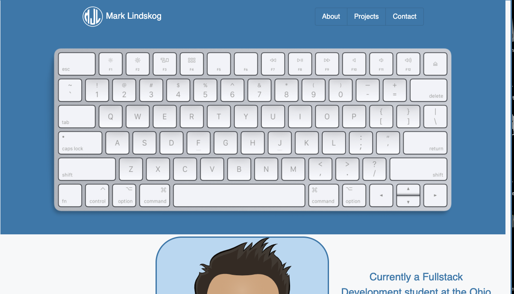

# Portfloio
## Description
- Created portfolio to display projects and work
- Portflio features contct and informative personal information along with projects

## Installation
Deployed URL:

https://mjlindskog.github.io/responsive-portfolio/

## Usage
Access URL to page, use navigation bar to locate sections, click on projects/links to acces separate page:

## Credits
https://avatarmaker.com/ -designed avatar through Avatar Maker and downloaded it

https://developer.mozilla.org/en-US/docs/Web/JavaScript/Reference - MDN was commonly referenced

https://getbootstrap.com/docs/5.0/getting-started/introduction/ - helped with bootstrap components

https://www.w3schools.com/jquery/default.asp - commonly referenced

https://coding-boot-camp.github.io/full-stack/github/professional-readme-guide - helped with the README guidelines

## License
MIT License

Copyright (c) 2021 Mark Lindskog

Permission is hereby granted, free of charge, to any person obtaining a copy
of this software and associated documentation files (the "Software"), to deal
in the Software without restriction, including without limitation the rights
to use, copy, modify, merge, publish, distribute, sublicense, and/or sell
copies of the Software, and to permit persons to whom the Software is
furnished to do so, subject to the following conditions:

The above copyright notice and this permission notice shall be included in all
copies or substantial portions of the Software.

THE SOFTWARE IS PROVIDED "AS IS", WITHOUT WARRANTY OF ANY KIND, EXPRESS OR
IMPLIED, INCLUDING BUT NOT LIMITED TO THE WARRANTIES OF MERCHANTABILITY,
FITNESS FOR A PARTICULAR PURPOSE AND NONINFRINGEMENT. IN NO EVENT SHALL THE
AUTHORS OR COPYRIGHT HOLDERS BE LIABLE FOR ANY CLAIM, DAMAGES OR OTHER
LIABILITY, WHETHER IN AN ACTION OF CONTRACT, TORT OR OTHERWISE, ARISING FROM,
OUT OF OR IN CONNECTION WITH THE SOFTWARE OR THE USE OR OTHER DEALINGS IN THE
SOFTWARE.